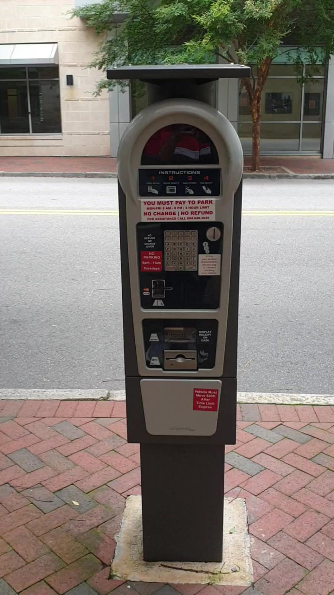
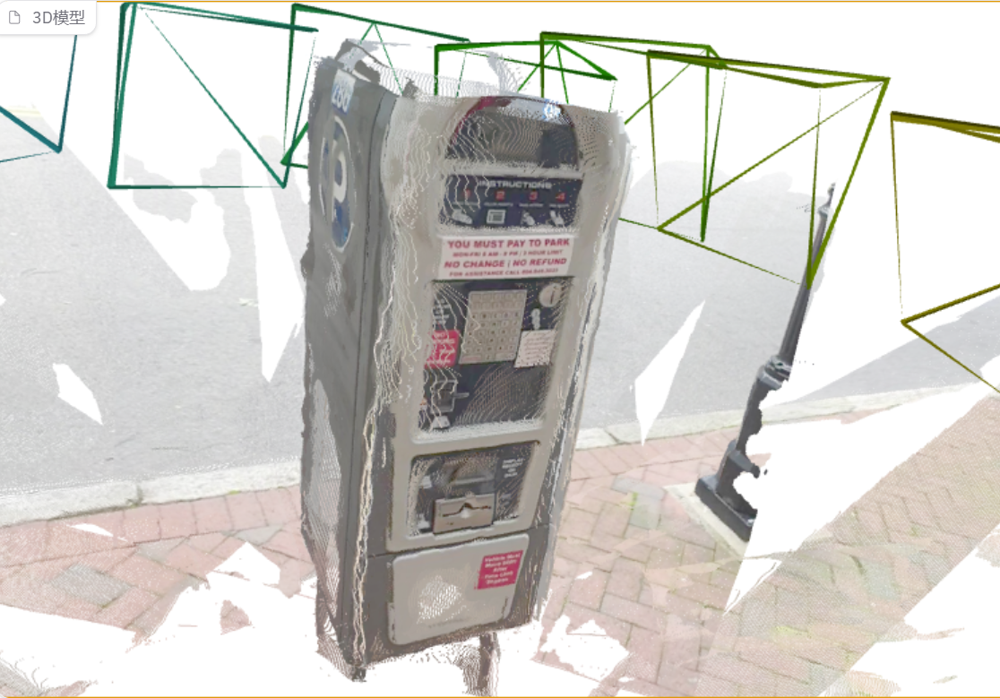
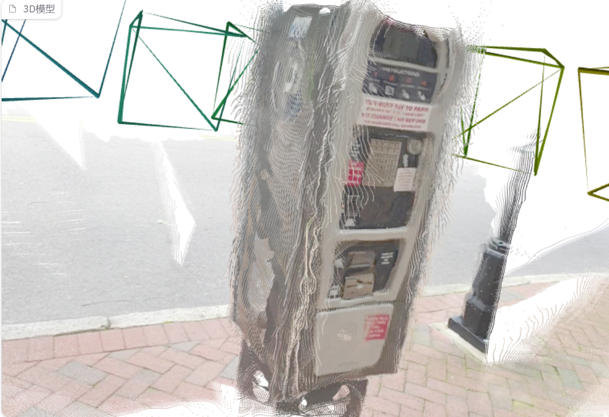

# VGGT 论文复现（非官方）

> 复现 **VGGT: Visual Geometry Grounded Transformer**（CVPR 2025）的前馈推理与 CO3D 相机位姿估计评估。
> 本仓库为个人学习用途的**非官方复现**，官方代码：<https://github.com/facebookresearch/vggt>

## 复现结果速览

在 CO3Dv2 `parkingmeter` 类别（fewview_dev test 子集，6 条序列 × 每序列随机 10 帧，seed=0，feed-forward 无 BA）：

| 指标 | 本复现 | 官方参考值 |
| --- | --- | --- |
| **AUC@30** | **0.9410** | 0.9536（官方 evaluation 分支，parkingmeter 单类别） |
| AUC@15 | 0.8933 | — |
| AUC@5 | 0.7200 | — |
| AUC@3 | 0.5691 | — |

**结论：与官方单类别参考值相差 1.26 个百分点，在数值抖动范围内，复现基本成立。**

### 为什么不是和论文的 88.2 比？

论文 Table 1 的 **88.2 是 41 个 CO3D 类别的平均值**，不能直接作为单类别对照目标：

| 口径 | AUC@30 |
| --- | --- |
| 论文 Table 1，41 类均值（feed-forward） | 0.882 |
| 官方 evaluation 代码，41 类全量均值 | 0.895 |
| 官方 evaluation 代码，41 类 fast_eval 均值 | 0.8998 |
| 官方 parkingmeter 单类别 | 0.9536 |
| **本复现 parkingmeter 单类别** | **0.9410** |

parkingmeter 属于较易类别（官方 41 类单类别值中偏上游），因此单类别分数高于全类均值是预期现象。

### 与官方值 1.26pt 差异的来源分析

1. **数值层面抖动**：帧采样由 `seed=0` 完全锁定（本复现的采样帧 id 与按官方协议预演的结果一致），剩余浮动只能来自 GPU 数值非确定性、bf16 精度与 torch/CUDA 版本差异。
2. **实现差异**：官方明确说明其公开的 evaluation 实现与论文内部实现存在约 1.3pt 的差异（官方代码 41 类均值 0.895 高于论文的 0.882）。
3. **小样本放大效应**：本类别 test 子集过质量过滤后仅 6 条序列，单条序列的波动会直接反映到总分。

## 可视化结果

| 输入帧 | Depthmap and Camera Branch | Pointmap Branch |
| --- | --- | --- |
|  |  |  |

>Confidence Threshold 25%,upload 15 images.

## 环境

| 组件 | 版本 |
| --- | --- |
| GPU | RTX 50 系（Blackwell 架构，sm_120），8GB 显存 |
| PyTorch | 2.7.1+cu128 |
| CUDA | 12.8 |
| 模型权重 | VGGT-1B（`model.pt`，本地加载） |
| 评估依赖 | pycolmap==3.10.0、pyceres==2.3、LightGlue |

> Blackwell（sm_120）必须使用 cu128 及以上构建的 PyTorch；安装时注意不要误装 `+cpu` 轮子。

## 复现步骤

### 1. 环境

```bash
conda create -n vggt python=3.10
pip install torch==2.7.1 --index-url https://download.pytorch.org/whl/cu128
pip install -e .
pip install pycolmap==3.10.0 pyceres==2.3
```

### 2. 推理 demo（前馈：位姿 / 深度 / 点云）

```bash
python demo_gradio.py   # Gradio 可视化
```

### 3. CO3D 评估（单类别小规模）

选择 `parkingmeter`：CO3Dv2 中体积最小的类别之一（官方分卷为 2MB 元数据卷 + 12GB 数据卷；评估实际只需 test 子集 6 条序列的 images，约 0.2GB）。

```bash
# 预处理：生成 parkingmeter_test.jgz
python preprocess_co3d.py --category parkingmeter \
    --co3d_v2_dir /path/to/co3d --output_dir /path/to/anno

# 评估：--debug 即只跑 parkingmeter
python test_co3d.py --debug --fast_eval \
    --model_path /path/to/model.pt \
    --co3d_dir /path/to/co3d --co3d_anno_dir /path/to/anno --seed 0
```

## 错误尝试

1. torch 装 `+cpu` 轮子,装完发现 `torch.cuda.is_available()` 为 False；Blackwell 必须指定 cu128 源。
2. `preprocess_co3d.py` 报 `No module named 'ipdb'`，开头 `import ipdb`、`import matplotlib.pyplot as plt` 是原作者调试残留，删除即可。
3. 在 [CO3D 官网](https://ai.meta.com/datasets/co3d-dataset) 下载的 parkingmeter 压缩包只有 2.8GB，内容有缺失：其 set_lists 中只有 21 条序列，评估所需 test 子集 6 条序列缺了 3 条，最后由 Kimi 从官方分卷中定位并补齐。
4. 官方分卷中 `parkingmeter_000.zip`（2MB）才是元数据卷（含 `set_lists/`），`parkingmeter_001.zip`（12GB）是纯图像/深度数据。
5. `test_co3d.py` 顶部 `from ba import ...` 即使不用 BA 也会触发 import，需装好 pycolmap/pyceres，且 `ba.py` 与脚本同目录，我在`from ba import ...`前面加了#将其注释掉。

## 局限说明

- 仅复现单类别（parkingmeter）小规模评估，未覆盖全部 41 类；整个co3d数据集有1.4T，我的电脑没有办法带动这么大数据集。
- 6 条序列 × 10 帧的样本量较小，分数存在自然波动。

## 数据与权重声明

本仓库**不包含**模型权重与数据集文件：

- VGGT-1B 权重：在 [Hugging Face](https://huggingface.co/facebook/VGGT-1B) 获取，遵循其非商用许可。
- CO3Dv2 数据集：在 [facebookresearch/co3d](https://github.com/facebookresearch/co3d) 获取，遵循其许可（研究用途）。

## 引用

```bibtex
@inproceedings{wang2025vggt,
  title     = {VGGT: Visual Geometry Grounded Transformer},
  author    = {Wang, Jianyuan and Chen, Minghao and Karaev, Nikita and Vedaldi, Andrea and Rupprecht, Christian and Novotny, David},
  booktitle = {CVPR},
  year      = {2025}
}
```

## .gitignore 建议

上传前在仓库根目录新建 `.gitignore` 文件，内容如下：

```gitignore
# 权重与数据（许可原因不上传）
*.pt
*.pth
ckpts/
parkingmeter/
co3d*/
anno/
*.jgz

# 输出
outputs/
*.ply

# Python
__pycache__/
*.pyc
```
